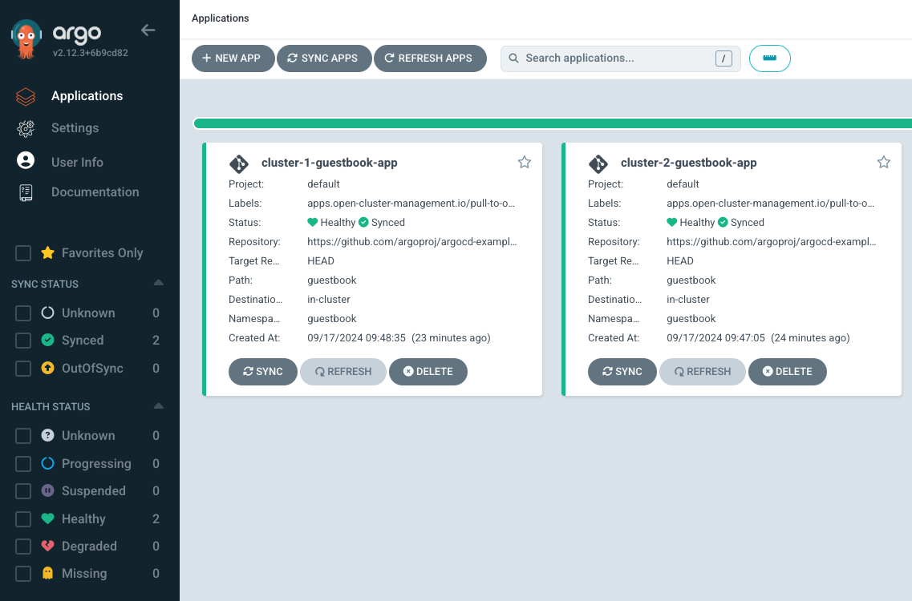

# Example OCM ArgoCD

## Architecture


## Prerequisites

- docker
- kubectl
- clusteradm
- argocd

## Installation

Install clusteradm CLI tool:
```
curl -L https://raw.githubusercontent.com/open-cluster-management-io/clusteradm/main/install.sh | bash
```

Install ArgoCD CLI
```
brew install argocd
```

## Bootstrap Hub Cluster

1. Start hub cluster and managed cluster containers:
```
docker compose up -d
```

2. Get kube config files:
```
docker exec hub cat /etc/rancher/k3s/k3s.yaml > ~/.kube/k3s-hub.config
docker exec cluster-1 cat /etc/rancher/k3s/k3s.yaml > ~/.kube/k3s-cluster-1.config
```

3. Bootstrap OCM hub cluster manager:
```
export KUBECONFIG=~/.kube/k3s-hub.config
clusteradm init --wait
```
This will print command to register a managed server.

4. Install ArgoCD

```
kubectl create namespace argocd
kubectl apply -n argocd -f https://raw.githubusercontent.com/argoproj/argo-cd/stable/manifests/install.yaml
```

5. Install [multicloud-integrations](https://github.com/open-cluster-management-io/multicloud-integrations?tab=readme-ov-file#quick-start) (only crds and controller).


6. Install Argocd pull controller:
```
kubectl apply -f https://raw.githubusercontent.com/open-cluster-management-io/argocd-pull-integration/main/deploy/install.yaml
```

7. Apply required resources:
```
kubectl apply -f hub
```

## Register Managed Cluster

1. Retrieve token from the hub cluster
```
clusteradm get token
```

2. Open another terminal and run the following command to join managed cluster to the hub cluster.
```
export KUBECONFIG=~/.kube/k3s-cluster-1.config
clusteradm join --hub-token <hub_token> --hub-apiserver <hub_apiserver_url> --wait --cluster-name cluster-1
```

3. On the hub cluster, accept the join request.
```
clusteradm accept --clusters cluster-1
```

4. Verify the managed cluster was created successfully:
```
kubectl get managedcluster
```
Then should print result resembles the following:
```
NAME        HUB ACCEPTED   MANAGED CLUSTER URLS   JOINED   AVAILABLE   AGE
cluster-1   true                                  True     True        2m1s
```

5. Install ArgoCD on the managed cluster:

```
kubectl create namespace argocd
kubectl apply -n argocd -f https://raw.githubusercontent.com/argoproj/argo-cd/stable/manifests/install.yaml
```

6. Apply cluster role and role binding:
```
kubectl apply -f managed
```

Repeat step 2 to 6 for cluster-2.

7. The `guestbook-app-placement` will match any clusters that have the label `purpose=demo`. We need to apply the label to cluster-1 and cluster-2.

```
kubectl label --overwrite managedcluster cluster-1 purpose=demo
kubectl label --overwrite managedcluster cluster-2 purpose=demo
```

8. Verify that the placement decisions contain both cluster-1 and cluster-2

```
$ kubectl get placementdecision guestbook-app-placement-decision-1 -n argocd -o json | jq '.status.decisions.[].clusterName'
"cluster-1"
"cluster-2"
```

## Deploy ApplicationSets

Deploy ApplicationSets on the hub cluster:

```
kubectl apply -f appsets
```

Verify that manifest work was created in cluster-1 and cluster-2 namespace.
```
$ kubectl get manifestwork -n cluster-1
NAME                            AGE
cluster-1-guestbook-app-a1203   5m47s
```

```
$ kubectl get manifestwork -n cluster-2
NAME                            AGE
cluster-2-guestbook-app-c443d   6m37s
```

Access ArgoCD dashboard:

```
kubectl port-forward svc/argocd-server -n argocd 8443:443
open https://localhost:8443
```

The dashboard will show `cluster-1-guestbook-app` and `cluster-2-guestbook-app` which are the application synced to cluster-1 and cluster-2.



On the managed cluster-1, verify that guestbook application was exist in argocd namespace:

```
$ kubectl get application -n argocd
NAME                      SYNC STATUS   HEALTH STATUS
cluster-1-guestbook-app   Synced        Healthy
```

Verify that guestbook deployment has been deployed.

```
$ kubectl get deployment -n guestbook
NAME           READY   UP-TO-DATE   AVAILABLE   AGE
guestbook-ui   1/1     1            1           42h
```

## References

- https://www.redhat.com/en/blog/introducing-the-argo-cd-application-pull-controller-for-open-cluster-management
- https://github.com/open-cluster-management-io/argocd-pull-integration
- https://github.com/open-cluster-management-io/multicloud-integrations
- https://github.com/open-cluster-management-io