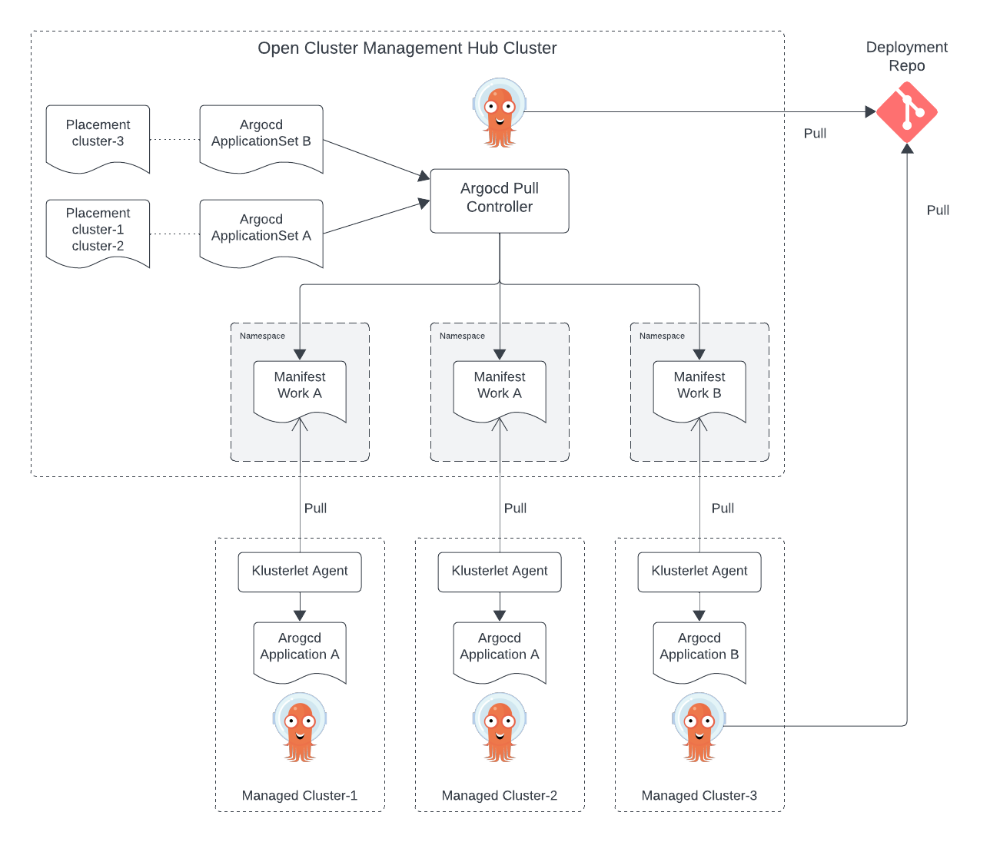

# Example OCM ArgoCD

## Architecture



## Prerequisites

- docker
- kubectl
- clusteradm
- argocd

## Installation

Install clusteradm CLI tool:
```
curl -L https://raw.githubusercontent.com/open-cluster-management-io/clusteradm/main/install.sh | bash
```

Install ArgoCD CLI
```
brew install argocd
```

## Bootstrap Hub Cluster

Start hub cluster and managed cluster containers:
```
docker compose up -d
```

Get kube config files:
```
docker exec hub cat /etc/rancher/k3s/k3s.yaml > ~/.kube/k3s-hub.config
docker exec cluster-1 cat /etc/rancher/k3s/k3s.yaml > ~/.kube/k3s-cluster-1.config
```

Bootstrap OCM hub cluster manager:
```
clusteradm init --wait
```
This will print command to register a managed server.

Install ArgoCD

```
kubectl create namespace argocd
kubectl apply -n argocd -f https://raw.githubusercontent.com/argoproj/argo-cd/stable/manifests/install.yaml
```

Install [multicloud-integrations](https://github.com/open-cluster-management-io/multicloud-integrations?tab=readme-ov-file#quick-start) (only crds and controller).


Install the pull controller:
```
kubectl apply -f https://raw.githubusercontent.com/open-cluster-management-io/argocd-pull-integration/main/deploy/install.yaml
```

```
kubectl apply -f hub
```

## Register Managed Cluster

Retrieve hub token
```
clusteradm get token
```

```
clusteradm join --hub-token <hub_token> --hub-apiserver <hub_apiserver_url> --wait --cluster-name cluster-1
```

On the hub cluster, accept the join request.
```
clusteradm accept --clusters cluster-1
```

Verify the managed cluster was created successfully:
```
kubectl get managedcluster
```
Then should print result resembles the following:
```
NAME        HUB ACCEPTED   MANAGED CLUSTER URLS   JOINED   AVAILABLE   AGE
cluster-1   true                                  True     True        2m1s
```

Install ArgoCD

```
kubectl create namespace argocd
kubectl apply -n argocd -f https://raw.githubusercontent.com/argoproj/argo-cd/stable/manifests/install.yaml
```

```
kubectl apply -f managed
```

## Deploy ApplicationSets

Deploy ApplicationSets on hub cluster:

```
kubectl apply -f appsets
```

Access ArgoCD dashboard:

```
kubectl port-forward svc/argocd-server -n argocd 8443:443
```

## Automated Upgrade Cluster

Install system-upgrade-controller and crds:
```
kubectl apply -f https://github.com/rancher/system-upgrade-controller/releases/latest/download/system-upgrade-controller.yaml
kubectl apply -f https://github.com/rancher/system-upgrade-controller/releases/latest/download/crd.yaml
```

## References

https://www.redhat.com/en/blog/introducing-the-argo-cd-application-pull-controller-for-open-cluster-management
https://github.com/open-cluster-management-io/argocd-pull-integration
https://github.com/open-cluster-management-io/multicloud-integrations
https://github.com/open-cluster-management-io